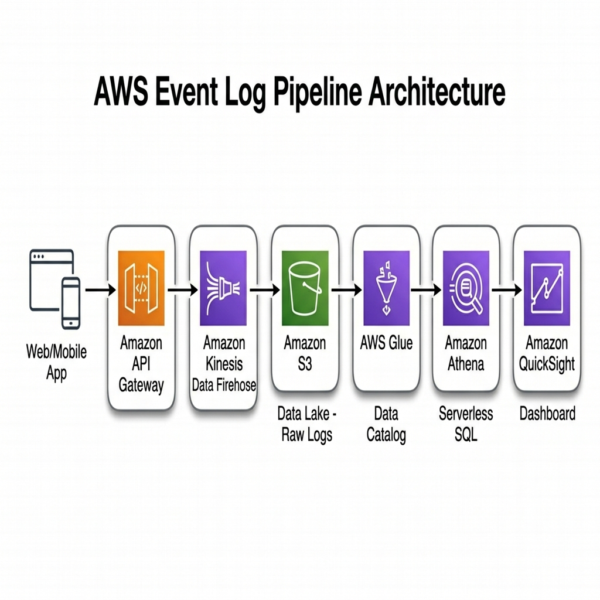

# 🚀 Event Log Pipeline (데이터 엔지니어링 과제)

웹 서비스(이커머스)에서 발생하는 유저의 행동 이벤트를 **생성 → 저장 → 분석 → 시각화**하는 데이터 파이프라인입니다.

---

## 1. 프로젝트 개요 및 실행 방법

### 사전 요구사항

- **Docker** 및 **Docker Compose** 가 설치되어 있어야 합니다.

### 실행 명령어

```bash
# 1. 레포지토리 클론
git clone https://github.com/Mepari/Test_PCW_2026.git
cd Test_PCW_2026

# 2. 파이프라인 실행 (빌드 포함)
docker compose up --build
```

> 💡 **실행 결과:** 명령어를 실행하면 PostgreSQL DB가 구동되고, Python App이 자동으로 **이벤트 2,000건 생성 → DB 적재 → 데이터 분석 → 시각화 이미지 생성** 후 종료됩니다.
> 결과 차트는 `./output/dashboard.png` 경로에 자동 저장됩니다.

### 프로젝트 구조

```text
Test_PCW_2026/
├── app/
│   ├── Dockerfile          # Python 앱 빌드 설정
│   ├── requirements.txt    # 의존성 목록
│   ├── main.py             # 파이프라인 오케스트레이터
│   ├── generator.py        # Step 1: 이벤트 생성기
│   ├── db.py               # Step 2: DB 연결 및 데이터 적재
│   ├── analyzer.py         # Step 3: SQL 분석 쿼리
│   └── visualizer.py       # Step 5: 차트 이미지 생성
├── db/
│   └── init.sql            # DB 테이블 생성 DDL
├── docs/
│   └── aws-architecture.png # 선택 B: AWS 아키텍처 구성도
├── output/                  # 실행 결과 차트 저장 위치
├── docker-compose.yml       # Step 4: Docker 전체 스택 구성
└── README.md
```

---

## 2. 이벤트 설계

### 이벤트 타입 (3종)

| 이벤트 타입 | 설명 | 발생 비율 | 고유 필드 |
|------------|------|-----------|-----------|
| `page_view` | 유저가 페이지를 조회 | 60% | `page_url` |
| `purchase` | 상품 구매 완료 | 25% | `amount` |
| `error` | 시스템/클라이언트 에러 | 15% | `error_code` |

### 설계 근거

- **page_view 60%**: 실제 이커머스에서 대부분의 트래픽은 페이지 조회입니다.
- **purchase 25%**: 실제 전환율(2~5%)보다 높게 설정하여 분석 시 의미 있는 데이터를 확보했습니다.
- **error 15%**: 에러 비율 모니터링이 파이프라인의 주요 분석 목적 중 하나이므로, 분석 가능한 수준으로 설정했습니다.
- **50명 유저 풀**: 유저별 집계 분석이 의미 있게 동작하도록 고정된 유저 풀을 유지합니다.
- **Faker.seed(42)**: 재현 가능한 데이터를 보장하여 동일한 결과를 검증할 수 있습니다.

---

## 3. 스키마 설계 및 데이터베이스 선택 이유

### 사용 데이터베이스: PostgreSQL

**선택 이유:**
이벤트 로그의 특성상 집계 분석 쿼리(`GROUP BY`, 시간대별 묶음 등)가 필수적이므로, RDBMS를 통해 데이터 무결성을 챙기고 분석 효율을 높이고자 했습니다. PostgreSQL은 `DATE_TRUNC()` 등 시계열 분석에 유용한 함수를 기본 제공하며, Docker 구성이 간편합니다.

### 테이블 스키마 (`events`)

```sql
CREATE TABLE events (
    id          UUID DEFAULT gen_random_uuid() PRIMARY KEY,
    timestamp   TIMESTAMP NOT NULL,
    user_id     INTEGER NOT NULL,
    event_type  VARCHAR(20) NOT NULL,
    platform    VARCHAR(10) NOT NULL,
    page_url    VARCHAR(255),          -- page_view일 때만 값 존재
    amount      DECIMAL(10, 2),        -- purchase일 때만 값 존재
    error_code  VARCHAR(10)            -- error일 때만 값 존재
);
```

### 설계 의도

- **JSON 통째 저장 지양**: 조회 조건으로 빈번히 쓰이는 핵심 필드(`timestamp`, `event_type`, `user_id`)를 공통 컬럼으로 구성하여 SQL 쿼리의 직관성을 높였습니다.
- **Nullable 컬럼 전략**: 이벤트 타입마다 존재 여부가 다른 가변 데이터(`page_url`, `amount`, `error_code`)는 Nullable 컬럼으로 분리했습니다.
- **DECIMAL(10,2)**: 금액(`amount`)은 소수점 정확도를 보장하기 위해 `INT` 대신 `DECIMAL`을 사용했습니다.
- **분석 인덱스**: `event_type`, `timestamp`, `user_id`에 인덱스를 생성하여 집계 쿼리 성능을 최적화했습니다.

---

## 4. 데이터 집계 분석 결과

### 분석 1: 이벤트 타입별 발생 비율

전체 트래픽 중 비정상(error) 이벤트의 비율을 파악합니다.

```sql
SELECT event_type, COUNT(*) as count
FROM events
GROUP BY event_type
ORDER BY count DESC;
```

### 분석 2: 시간대별 이벤트 수 및 매출 추이

이벤트 발생 시간(hour)을 기준으로 묶어 트래픽 피크 타임과 매출의 상관관계를 분석합니다.

```sql
SELECT
    DATE_TRUNC('hour', timestamp) as hour,
    COUNT(*) as event_count,
    COALESCE(SUM(amount), 0) as total_revenue
FROM events
GROUP BY hour
ORDER BY hour;
```

### 분석 3: 유저별 총 이벤트 수 TOP 10

가장 활발한 헤비 유저를 식별합니다.

```sql
SELECT user_id, COUNT(*) as event_count
FROM events
GROUP BY user_id
ORDER BY event_count DESC
LIMIT 10;
```

### 시각화 결과

파이프라인 실행 후 아래와 같은 대시보드가 `./output/dashboard.png`에 자동 생성됩니다:

*(실행 후 `output/dashboard.png` 이미지가 여기에 생성됩니다)*

---

## 5. 💡 구현하면서 고민한 점

### Docker 컨테이너 실행 순서 보장

`docker compose up` 시 DB가 켜지기도 전에 Python 앱이 쿼리를 시도하여 Connection Error가 나는 문제를 예방했습니다.

**해결 방법 (이중 안전장치):**
1. **인프라 레벨**: DB 컨테이너에 `healthcheck` (`pg_isready`)를 설정하고, App 컨테이너가 `service_healthy` 상태를 기다리게 (`depends_on`) 하여 순서를 보장했습니다.
2. **앱 레벨**: Python 코드 내부에도 DB 연결 재시도 로직(최대 10회, 2초 간격)을 구현하여, 인프라가 예상과 다르게 동작하는 경우에도 안정적으로 연결됩니다.

### 하드코딩 방지

DB 접속 정보를 코드에 명시하지 않고, Docker 환경변수(`DATABASE_URL`)를 통해 주입받도록 구성하여 **보안과 이식성**을 고려했습니다. 이벤트 생성 건수(`EVENT_COUNT`)도 환경변수로 조절 가능합니다.

### 모듈 분리

모든 로직을 `main.py` 하나에 넣는 대신, 역할별로 모듈을 분리(`generator.py`, `db.py`, `analyzer.py`, `visualizer.py`)하여 코드의 가독성과 유지보수성을 높였습니다.

### 데이터 재현성

`Faker.seed(42)`와 `random.seed(42)`를 고정하여, 동일한 조건에서 실행하면 항상 같은 데이터가 생성됩니다. 이를 통해 분석 결과의 일관성을 보장하고, 디버깅이 용이합니다.

---

## 6. [선택 과제 B] AWS 기반 대규모 파이프라인 설계

### 아키텍처 구성도



### 각 서비스의 역할

| AWS 서비스 | 역할 | 이 과제에서의 대응 |
|-----------|------|-------------------|
| **API Gateway** | 이벤트 수신 엔드포인트 (RESTful API) | Python 이벤트 생성기 |
| **Kinesis Data Firehose** | 실시간 스트리밍 버퍼, 트래픽 스파이크 시 병목 방지 | (해당 없음) |
| **S3 (Data Lake)** | 무제한의 로그 데이터를 가장 저렴하고 안전하게 영구 보관 | PostgreSQL |
| **AWS Glue** | 데이터 카탈로그 — S3 데이터의 스키마를 자동 추론/관리 | init.sql (수동 스키마) |
| **Amazon Athena** | S3 원본 데이터를 서버리스로 SQL 분석 (별도 DB 구축 불필요) | SQL 분석 쿼리 |
| **Amazon QuickSight** | 대시보드 시각화 (BI 도구) | Matplotlib 차트 |

### 가장 고민한 부분

이번 과제는 소규모(2,000건)이므로 PostgreSQL(RDBMS)로 충분합니다. 하지만 **실무 환경에서 초당 수천 건의 로그가 발생하면** DB의 쓰기(Write) 부하가 서비스 장애로 이어질 수 있습니다.

따라서 AWS 설계에서는:
- **Kinesis Data Firehose**로 트래픽을 완충(버퍼링)하여 DB 부하를 제거하고,
- **S3 (Object Storage)**에 저렴하게 영구 저장한 뒤,
- **Athena**로 서버리스 SQL 분석하는 구조를 설계했습니다.

이 아키텍처는 컴퓨팅 노드 중심(RDBMS)에서 **스토리지 중심(Data Lake)**으로 전환하여, 시스템 결합도를 낮추고 **무한한 수평 확장**이 가능합니다.

---

## 기술 스택

| 구분 | 기술 | 선택 이유 |
|------|------|-----------|
| 언어 | Python 3.12 | Faker + Pandas + Matplotlib로 전 과정 커버 |
| DB | PostgreSQL 17 | 정형 스키마 + SQL 분석에 최적 |
| DB 드라이버 | psycopg 3 | 2026년 기준 신규 프로젝트 권장 드라이버 |
| 시각화 | Matplotlib + Seaborn | 차트 이미지 자동 생성, BI 도구 대비 경량 |
| 컨테이너 | Docker Compose v2 | 단일 명령어로 전체 스택 실행 |
